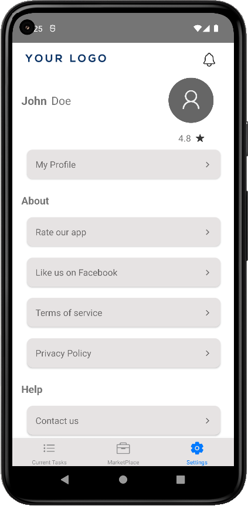

# Tasker App

The Tasker App is a minimal viable product (MVP) application that allows users to manage customer tasks. It provides features for user authentication, task assignment, task completion, photo uploads, and supports two localized languages. Please note that for demonstration purposes, the app currently uses hardcoded information and is ready for integration with a database. This project was done during an internship

## Features

- User Login: Users can authenticate themselves to access the app.
- Task Management: Users can view and take on customer tasks.
- Task Completion: Users can mark tasks as completed.
- Photo Uploads: Users can upload photos related to the tasks.
- Localization: The app supports two languages for a localized user experience.
- Dark and Light Mode: Users can switch between dark and light themes for personalized preferences.

## Screenshots

 
 
 
  

